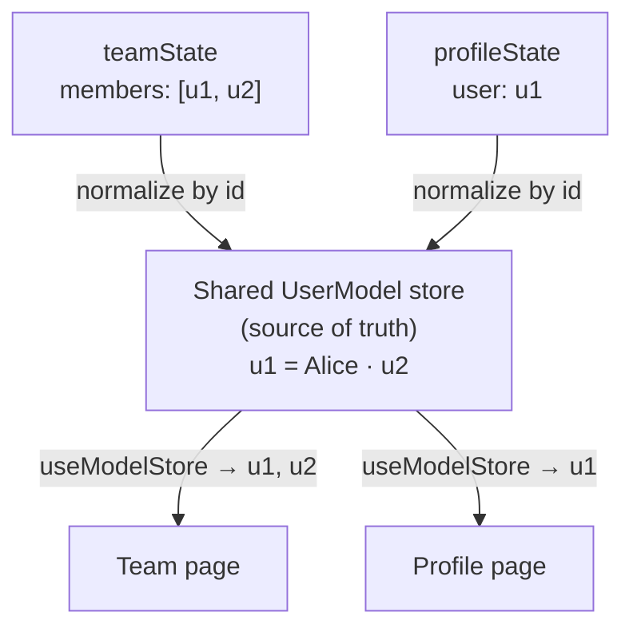

# Normalization [Store each entity once, reference it by id]

Normalization is the idea rxfy is built around: store each entity **once**, keyed by its id,
and reference it by id everywhere else.

:::note[Mental model]
Entities are rows in a table keyed by id · a query holds a list of those
ids · components render by id.
:::

The APIs below (`defineState`, `useStateData`, `Pending`, `useModelStore`) are covered in
[Model](/rxfy/create-model), [State](/rxfy/define-state), and
[React Bindings](/react); they appear here only to make the idea concrete.

## The problem: the same entity on two pages

A **team page** lists users; a **profile page** shows one user in detail. They are separate
features with their own fetches and their own state, but they overlap: Alice (`u1`) is both a
team member and the profile being viewed.

```ts
// Team page: its own state
const teamState = defineState({
  key: "team",
  params: z.object({ teamId: z.string() }),
  model: { members: array(UserModel) },
});

// Profile page: its own, separate state
const profileState = defineState({
  key: "profile",
  params: z.object({ userId: z.string() }),
  model: { user: single(UserModel) },
});
```

If each page kept its **own copy** of the user (local component state, or a per-feature store
slice), you'd have two Alices. Rename her on the profile page and the team row stays stale
until it happens to re-fetch. Now the two copies disagree, and one is wrong.

## One store, shared by id

Both states reference the same **model**. A model is an entity type plus how to read its id:

```ts
const UserModel = createModel({
  schema: z.object({ id: z.string(), name: z.string() }),
  getKey: (user) => user.id,
  name: "user",
});
```

Because both `teamState` and `profileState` declare `UserModel`, rxfy keys every user by that
`getKey` id and stores it **once**, in a single `UserModel` store, no matter which state
fetched it. Each query then keeps only **ids**; the entity data lives in the shared store:



Each page subscribes to its own `data$` (ids only) and reads entities by id from the shared
store. The team page resolves `"u1"` against the same store the profile page wrote to, so both
render one user from one source.

## Why it matters

Because Alice is a single cell, an update reaches everyone at once. Edit her on the profile
page, say from a button handler, and the write goes straight to the shared store:

```tsx
function RenameButton({ id }: { id: string }) {
  const store = useModelStore(UserModel);
  return <button onClick={() => store.get(id).modify((user) => ({ ...user, name: "John Doe" }))}>Rename</button>;
}
```

That one write, equally from a mutation or a websocket push, updates the profile header
**and** the team row in the same render, with no re-fetch and no stale copies. That's why
`data$` emits ids rather than entities.

The same dedup happens within one query: if a state has the user as two separate fields (say an
`author` and a list of `commenters`), both fields resolve to the one cell. Mutations take the
same path; see [State](/rxfy/define-state).

## What it costs

You pay for this in three places:

- You declare a **model + `getKey`** for each entity type (`createModel`).
- Components **render by id** (a `useModelStore(...).get(id)` hop) instead of reading entity
  data inline from the query.
- Mutations **denormalize → reduce → renormalize**, so reducers still work with whole entities.

In return you get one source of truth, per-entity subscriptions, and real-time sync with no
re-fetching. It pays off most when the same entity appears on many pages.

## In rxfy

- [`createModel`](/rxfy/create-model) defines an entity type and its id (`getKey`).
- [`defineState`](/rxfy/define-state) declares which fields hold which model; the fetch
  result is normalized into the shared model stores plus an id-only query shape automatically.
- [`data$`](/react/use-state-data) emits that id shape; [`useModelStore`](/react/use-model-store)
  reads an entity by id and re-renders only when that entity changes, across every page that
  references it.
