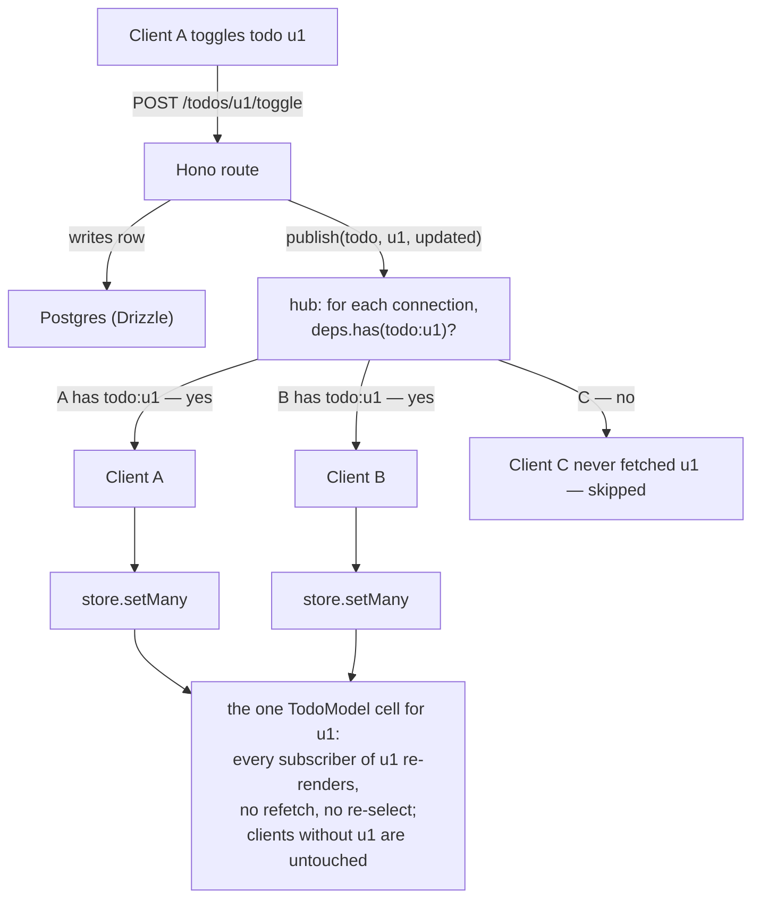

# Live updates over WebSockets [Push entity changes to exactly the clients that hold them]

Normalization does most of the work here. Because every entity lives in **one** keyed cell
(see [Normalization](/core-concepts/normalization)), a server push doesn't need to know which client renders
what. The push carries a new entity value, the client writes it into the shared store, and
every component subscribed to that entity re-renders. No refetch, no re-selection.

Normalization also defines the **subscription set**: the ids a client fetched and normalized
are the entities it should receive updates for. Instead of broadcasting every change to every
client, each connection subscribes to the ids it holds, and the server pushes a change only to
the connections that hold that id.

This guide wires that up end to end: a [Drizzle](https://orm.drizzle.team) +
[Hono](https://hono.dev) server that tracks each connection's dependency set, and a small
client that subscribes to whatever lands in the model store (via the
[`registry.added$`](/core-concepts/model#observing-what-enters-the-store) stream) and ingests pushes
with [`store.setMany`](/core-concepts/model#modelstore-entity). Your existing `useStateData` /
`useModelStore` components don't change; nothing in them is live-aware.

:::info
rxfy ships **no** WebSocket helper. Everything below is user-land code, a thin layer
between the socket and the model store.
:::

:::file-tree
- shared
  - todo.ts
- server
  - db.ts
  - hub.ts
  - index.ts
- client
  - LiveProvider.tsx
  - useStoreSubscriptions.ts
  - useLiveEntities.ts
:::

## The messages

Two envelopes flow over the socket. The client names each entity by **topic**, a
`name:id` string pairing the model's `name` with an entity id, and adds topics to its
dependency set. The server pushes matching entities back.

A topic is a string at runtime, but giving it a **branded template literal type**,
shared by both sides like the schema, means only a value built by `modelTopic()`
satisfies `Topic`, so a bare `"todo:u1"` or a `name`/`id` passed in the wrong order won't
type-check:

`Topic` is provided by `rxfy` — no local file needed:

```ts
import { type Topic, modelTopic } from "rxfy";
```

Use `modelTopic` on the client when you have a `ModelDescriptor` and an entity id:

```ts
// e.g. for a manual subscription
client.want(modelTopic(TodoModel, id));
```

(The `useStoreSubscriptions` hook below derives topics from `registry.added$` which emits
strings, so it uses the `` `${name}:${key}` as Topic `` cast instead.)

```ts
// client → server: add/remove entities in this connection's dependency set
type DepsMessage = { type: "add" | "remove"; topics: Topic[] }; // e.g. ["todo:u1", "todo:u2"]

// server → client: entities that changed, grouped by model
type EntityPush = { name: string; entities: unknown[] };
```

The protocol carries both `add` and `remove`, but the store-driven client below only ever
sends `add`: it subscribes to whatever it loads and never drops a topic (see
[the trade-off](#subscription-manager)). The `remove` path is there for when you outgrow that.

Routing by `name` lets one socket carry every model, and means **live models need a `name`**,
the same requirement [SSR](/ssr) already imposes.

## Server

### Schema, shared with the model

Define the entity's zod schema once and use it on both sides, `createModel` on the client
and validation on the server, so they can't drift. The Drizzle table mirrors it (or use
`drizzle-zod` to derive one from the other).

```ts [shared/todo.ts]
// imported by client and server
import { z } from "zod";

export const TodoSchema = z.object({
  id: z.string(),
  title: z.string(),
  done: z.boolean(),
});
export type Todo = z.infer<typeof TodoSchema>;
```

```ts [server/db.ts]
import { drizzle } from "drizzle-orm/node-postgres";
import { pgTable, text, boolean } from "drizzle-orm/pg-core";

export const todos = pgTable("todos", {
  id: text("id").primaryKey(),
  title: text("title").notNull(),
  done: boolean("done").notNull().default(false),
});

export const db = drizzle(process.env.DATABASE_URL!);
```

### Dependency hub

The hub holds **one set per connection**: the entities that connection depends on. That's
the entire subscription state: no per-entity index, no thousands of small sets to churn as
ids come and go. A client adds and removes topics as its dependency graph changes; `publish`
walks the connections and delivers to those whose set includes the changed entity.

```ts [server/hub.ts]
import type { WSContext } from "hono/ws";
import { type Topic } from "rxfy";

export class Hub {
  // connection -> the entities it depends on, e.g. {"todo:u1", "todo:u2"}
  private readonly deps = new Map<WSContext, Set<Topic>>();

  addClient(ws: WSContext) {
    this.deps.set(ws, new Set());
  }

  removeClient(ws: WSContext) {
    this.deps.delete(ws);
  }

  addDeps(ws: WSContext, topics: Topic[]) {
    const set = this.deps.get(ws);
    if (set) for (const t of topics) set.add(t);
  }

  removeDeps(ws: WSContext, topics: Topic[]) {
    const set = this.deps.get(ws);
    if (set) for (const t of topics) set.delete(t);
  }

  // Push one entity to the connections whose dependency graph includes it.
  publish(name: string, id: string, entity: unknown) {
    const t = `${name}:${id}` as Topic;
    const message = JSON.stringify({ name, entities: [entity] });
    for (const [ws, set] of this.deps) {
      if (set.has(t)) ws.send(message);
    }
  }
}

export const hub = new Hub();
```

`publish` is O(connections), not O(entities), the trade for keeping memory at one set per
client. If a hot entity needs O(subscribers) fan-out later, add a reverse index then; most
apps never need it.

### Routes and the socket

`GET /todos` backs the initial `useStateData` fetch. The mutation route writes to Postgres and
then `publish`es the changed row to its topic, reaching every client holding that todo and
no one else. The WebSocket handler turns `sub` / `unsub` messages into hub calls.

```ts [server/index.ts]
import { serve } from "@hono/node-server";
import { createNodeWebSocket } from "@hono/node-ws";
import { Hono } from "hono";
import { eq } from "drizzle-orm";
import { db, todos } from "./db";
import { hub } from "./hub";
import type { Topic } from "rxfy";

const app = new Hono();
const { upgradeWebSocket, injectWebSocket } = createNodeWebSocket({ app });

// Initial fetch: the denormalized shape useStateData expects.
app.get("/todos", async (c) => {
  const rows = await db.select().from(todos);
  return c.json({ todos: rows });
});

// Mutation: persist, then push to the entity's subscribers only.
app.post("/todos/:id/toggle", async (c) => {
  const id = c.req.param("id");
  const [row] = await db.select().from(todos).where(eq(todos.id, id));
  const [updated] = await db
    .update(todos)
    .set({ done: !row.done })
    .where(eq(todos.id, id))
    .returning();

  hub.publish("todo", updated.id, updated); // <- targeted live update
  return c.json(updated);
});

app.get(
  "/ws",
  upgradeWebSocket(() => ({
    onOpen: (_evt, ws) => hub.addClient(ws),
    onMessage: (evt, ws) => {
      const msg = JSON.parse(evt.data.toString()) as { type: string; topics: Topic[] };
      if (msg.type === "add") hub.addDeps(ws, msg.topics);
      if (msg.type === "remove") hub.removeDeps(ws, msg.topics);
    },
    onClose: (_evt, ws) => hub.removeClient(ws),
  })),
);

const server = serve({ fetch: app.fetch, port: 3000 });
injectWebSocket(server);
```

## Client

The client has three small parts: a **subscription manager** that tells the server which
topics this connection wants, a **one-line effect** that feeds it every entity the store
holds, and the **ingest** that applies pushes back into the store.

### Subscription manager

The store already knows what to subscribe to. An entity is in the store *because this client
fetched it*, so the store's contents are the topics the client wants live. That keeps the
manager small: it accumulates topics and tells the server about the ones it hasn't heard
about yet. There's no per-component bookkeeping and no unsubscribe path, because the store
doesn't evict; once you've loaded an entity you stay live on it for the session.

:::warning[The trade-off]
This subscribes to *everything the client has loaded* and never drops a
topic. That's the deliberate simplification: the server only pushes entities that actually
*change*, and a push into a cell nothing renders is a cheap `setMany`. If you later need to
shed subscriptions (very long sessions, strict fan-out budgets), add a remove path keyed on
store eviction; most apps never do.
:::

`createSubscriptionManager` is provided by `rxfy`:

```ts
import { createSubscriptionManager, type SubscriptionManager } from "rxfy";
export type { SubscriptionManager };
```

Call it with a `send` function that writes to the socket:

```ts [LiveProvider.tsx (excerpt)]
const manager = createSubscriptionManager((topics) => {
  if (socket.readyState === WebSocket.OPEN) {
    socket.send(JSON.stringify({ type: "add", topics }));
  }
});

// On reconnect — replays the full desired set to the new connection
socket.addEventListener("open", () => manager.reconnect());
```

### Drive subscriptions from the store

This is where the core [`registry.added$`](/core-concepts/model#observing-what-enters-the-store)
stream earns its place. It emits `{ name, key }` the first time any **named** entity lands in
the store (from the initial `useStateData` fetch, from SSR hydration, or from a live push) and
**replays what's already there** to a late subscriber. One subscription, mounted once, keeps
the connection live on the store's contents. No component passes ids anywhere; there's no
`useLiveQuery`.

```ts [useStoreSubscriptions.ts]
import { useEffect } from "react";
import { type Topic } from "rxfy";
import { useModelRegistry } from "rxfy-react";
import { useLiveClient } from "./LiveProvider";

export function useStoreSubscriptions() {
  const registry = useModelRegistry();
  const client = useLiveClient();

  useEffect(() => {
    const sub = registry.added$.subscribe(({ name, key }) =>
      client.want(`${name}:${key}` as Topic),
    );
    return () => sub.unsubscribe();
  }, [registry, client]);
}
```

The replay is what makes this race-free: it doesn't matter whether an entity was normalized
into the store *before* this effect ran (initial fetch, hydration) or *after* (a later query, a
push); `added$` delivers it either way, exactly once, and `want` dedupes the rest.

### Ingest pushes

A push arrives → validate each entity with the model's own schema → `store.setMany`. Use
`addEventListener` (not `socket.onmessage =`) so several models can share one socket.

```tsx [useLiveEntities.ts]
import { useEffect } from "react";
import type { ModelDescriptor } from "rxfy";
import { useModelStore } from "rxfy-react";

export function useLiveEntities<T>(model: ModelDescriptor<T>, socket: WebSocket) {
  const store = useModelStore(model);

  useEffect(() => {
    const handler = (event: MessageEvent) => {
      const msg = JSON.parse(event.data) as { name: string; entities: unknown[] };
      if (msg.name !== model.name) return;
      store.setMany(msg.entities.map((row) => model.schema.parse(row)));
    };
    socket.addEventListener("message", handler);
    return () => socket.removeEventListener("message", handler);
  }, [store, socket, model]);
}
```

### Wire it together

One provider owns the socket and the client, drives subscriptions off the store, runs ingest
for each live model, and exposes the client through context. Mount it under `StoreProvider` so
`useModelRegistry` resolves. Note the split: `useStoreSubscriptions` is the *outbound* half
(store → server, "subscribe me to these"), `useLiveEntities` is the *inbound* half (server →
store, "here's a change").

```tsx [LiveProvider.tsx]
import { createContext, useContext, useEffect, useMemo } from "react";
import { createSubscriptionManager, type SubscriptionManager } from "rxfy";
import { useStoreSubscriptions } from "./useStoreSubscriptions";
import { useLiveEntities } from "./useLiveEntities";
import { TodoModel } from "./models";

const LiveContext = createContext<SubscriptionManager | null>(null);

export function useLiveClient() {
  const client = useContext(LiveContext);
  if (!client) throw new Error("useLiveClient must be used within <LiveProvider>");
  return client;
}

function LiveBridge({ socket }: { socket: WebSocket }) {
  useStoreSubscriptions();             // outbound: subscribe to whatever the store holds
  useLiveEntities(TodoModel, socket);  // inbound: apply pushes, one line per live model
  return null;
}

export function LiveProvider({ children }: { children: React.ReactNode }) {
  const socket = useMemo(() => new WebSocket("ws://localhost:3000/ws"), []);
  const client = useMemo(
    () =>
      createSubscriptionManager((topics) => {
        if (socket.readyState === WebSocket.OPEN) {
          socket.send(JSON.stringify({ type: "add", topics }));
        }
      }),
    [socket],
  );

  useEffect(() => {
    socket.addEventListener("open", () => client.reconnect());
    return () => socket.close();
  }, [socket, client]);

  return (
    <LiveContext.Provider value={client}>
      <LiveBridge socket={socket} />
      {children}
    </LiveContext.Provider>
  );
}
```

:::note
`LiveBridge` is a child of the context provider so its hooks can call `useLiveClient` (via
`useStoreSubscriptions`); the socket lives in the parent and is passed down as a prop.
:::

```tsx
<StoreProvider>
  <LiveProvider>
    <App />
  </LiveProvider>
</StoreProvider>
```

A component fetches as it always would; **nothing in it is live-aware**. The moment
`useStateData` normalizes the todos into the store, `added$` fires and the connection subscribes
to them; no ids are threaded anywhere:

```tsx
function TodoApp() {
  const params = useMemo(() => ({ filter: "all" as const }), []);
  const { data$ } = useStateData({ state: todosState, fetchFn: fetchTodos, params });

  return (
    <Pending value$={data$} pending={<p>Loading...</p>}>
      {({ todos }) => <ul>{todos.map((id) => <TodoItem key={id} id={id} />)}</ul>}
    </Pending>
  );
}
```

The `TodoItem` rows already subscribe per entity through
[`useModelStore`](/react/use-model-store). When a push writes a row into its cell, only the rows
holding that id re-render, and only the clients that fetched it received the push.

## How it flows



## Adding and removing items

A push updates an entity's **value** (a rename, a toggle), and that reaches every subscriber.
It does **not** change which ids a query lists: `data$` is an id array owned by the
query cache (see [`useStateData`](/react/use-state-data)), and `setMany` only writes entity
cells. (A deleted row leaves the list but its topic stays subscribed, which is harmless: the
server has nothing more to push for it.)

So when a row is **created or deleted** and must appear in or vanish from a list, that's a
change to the query's id array, not an entity value. Handle it with the tools built for it:

- **Same client.** A [`useStateData` mutation](/core-concepts/state#definestate) updates the local
  id list right away (and the entity cells under it).
- **Other clients.** Call the handle's `reload()` to re-pull the list, or push a list-level
  message that replaces the query's ids. The per-entity socket above handles single entities;
  list membership is a separate concern.

## Reconnection and initial state

- **Initial state still comes from `useStateData`** (or [SSR](/ssr)): the socket only carries
  *changes*, so first paint is fulfilled before the socket has said anything.
- **On reconnect**, `createSubscriptionManager` replays the full desired set via `manager.reconnect()` (every topic loaded this
  session, since the server forgot all of it), and a `reload()` of the active queries re-pulls
  any entity values missed while offline.
- **Validation failures** (`model.schema.parse` throwing) surface a malformed push instead of
  poisoning the store; keep the schema authoritative.
