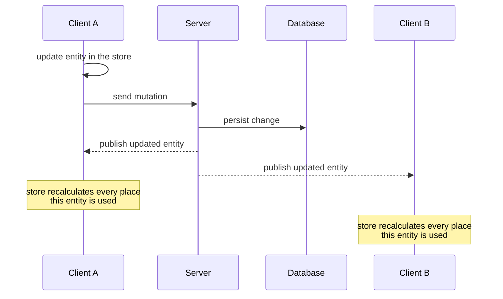

# rxfy [Typed, normalized, reactive state — built on RxJS]

**rxfy** (/ɑɹ ɪks faɪ/) is a reactive data-flow layer for your UI: declare typed models, states, and normalized stores as Observables, and scale from a client-only store to a fully live app with server-side rendering and real-time updates. It's built for consistency and granular reactivity at no extra cost.

rxfy is built on three principles:

- Every entity lives in a normalized store, accessed granularly by its id; an update reaches every subscriber automatically.
- Each page has its own state composed with the data from normalized stores; components are the granular consumers of that state — each updates only when the data it reads changes.
- States and stores are serializable: rxfy has first-class Server-Side Rendering (SSR) support.

```bash
npm install rxfy rxfy-react
```

[Why rxfy?](/why) explains the thinking behind this design.

## The problem it solves

You update one todo: mark it done, rename it from a detail view, or apply a websocket push the
server already made. Every view of that entity now has to agree. Most apps pick one of three
fixes: refetch the list (a round-trip for data you already have), patch it in place (two copies
that diverge as soon as another query renders the same entity), or coordinate the cache by hand
(miss one invalidation and the first symptom is a stale UI in production). SSR compounds it —
after server-rendering the page, rehydration wiring is usually left to you.

rxfy stores each entity **once**, in a normalized cell keyed by its id. Page state holds only
ids; components subscribe to the exact cells they render, so one write reaches every
subscriber. States and stores serialize, which gives you server-side rendering out of the box.
With the framework on top, the write crosses the network too: the server persists it and
publishes it to every connected client, where each store recalculates the places that entity
is used.



## See it in code

::::steps

### Model: one cell per entity

A model binds a Zod schema to an id extractor, so every todo lives in exactly one store slot,
found by `getKey`. This is what lets the same entity be shared instead of copied.

```tsx
import { z } from "zod";
import { createModel } from "rxfy";

const TodoModel = createModel({
  schema: z.object({ id: z.string(), title: z.string(), done: z.boolean() }),
  getKey: (x) => x.id,
  name: "todo",
});
```

### State: the query keeps only ids

`defineState` declares what a page loads and how a fetch result maps onto it. `array(TodoModel)`
means "a list of todo ids" — rxfy normalizes the fetched entities into the store and leaves the
query holding ids, so the list never owns a second copy of each todo.

```tsx
import { defineState, array } from "rxfy";

const todosState = defineState({
  key: "todos",
  params: z.object({ filter: z.enum(["all", "active", "done"]) }),
  model: {
    todos: array(TodoModel),
  },
});
```

### Render the list from ids

`useStateData` wires the state to your fetch function and returns a reactive `data$`. `Pending`
handles loading and error states declaratively. Notice the list maps over **ids** and delegates
each row — it never touches todo fields, so adding or editing a todo never re-renders the list.

```tsx
import { Pending, useStateData } from "rxfy-react";

function TodoApp() {
  const { data$ } = useStateData({
    state: todosState,
    fetchFn: fetchTodos,
    params: { filter: "all" },
  });

  return (
    <Pending value$={data$} pending={<p>Loading...</p>} rejected={({ error }) => <p>{String(error)}</p>}>
      {({ todos }) => (
        <ul>
          {todos.map((id) => (
            <TodoItem key={id} id={id} />
          ))}
        </ul>
      )}
    </Pending>
  );
}
```

### One write, every view agrees

Each row subscribes to its own cell and writes straight to it. Toggling a todo updates that one
cell — this row re-renders, and so would a detail panel or a header count reading the same id.
No refetch, no manual sync. That is the problem from the top, solved.

```tsx
import { useMemo } from "react";
import { useModelStore } from "rxfy-react";

function TodoItem({ id }: { id: string }) {
  const store = useModelStore(TodoModel);
  const todo$ = useMemo(() => store.get(id), [store, id]);

  return (
    <Pending value$={todo$}>
      {(todo) => (
        <li>
          <input
            type="checkbox"
            checked={todo.done}
            onChange={() => store.entity(id).modify((t) => ({ ...t, done: !t.done }))}
          />
          {todo.title}
        </li>
      )}
    </Pending>
  );
}
```

::::

## Continue with

- [Getting Started](/getting-started) — install rxfy and choose your path: a client-only store or the full live-app stack.
- [Using rxfy with agent skills](/agent-skills) — give your AI coding assistant accurate rxfy context.
- [Comparison with other libraries](/comparison) — how rxfy relates to TanStack Query and other libraries.
- [Why should I use rxfy?](/why) — the thinking behind the design.

## Useful links

- [rxfy on npm](https://www.npmjs.com/package/rxfy)
- [GitHub repository](https://github.com/vanya2h/rxfy)
- [About the author](https://vanya2h.me)
