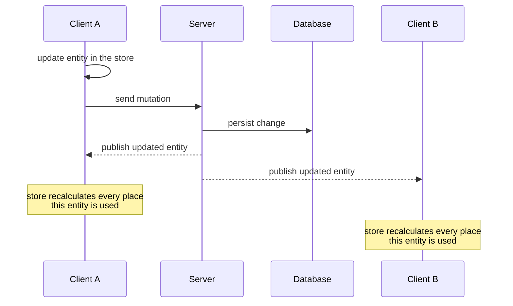

# rxfy [Typed, normalized, reactive state — built on RxJS]

**rxfy** (/ɑɹ ɪks faɪ/) is a reactive data-flow layer for your UI: declare typed models, states, and normalized stores as Observables, and scale from a client-only store to a fully live app with server-side rendering and real-time updates. It's built for consistency and granular reactivity at no extra cost.

rxfy is built on four principles:

- Every entity lives in a normalized store, accessed granularly by its id; an update reaches every subscriber automatically.
- Each page has its own state composed with the data from normalized stores; components are the granular consumers of that state — each updates only when the data it reads changes.
- Values unwrap late: data travels through the app still wrapped as Observables, only the leaf component that renders a value unwraps it, and a write to the store never unwraps anything.
- States and stores are serializable: rxfy has first-class Server-Side Rendering (SSR) support.

```bash
npm install rxfy rxfy-react
```

[Why rxfy?](/why) explains the thinking behind this design.

## The problem it solves

You update one todo: mark it done, rename it from a detail view, or apply a websocket push the
server already made. Every view of that entity now has to agree. Most apps pick one of three
fixes: refetch the list (a round-trip for data you already have), patch it in place (two copies
that diverge as soon as another query renders the same entity), or coordinate the cache by hand
(miss one invalidation and the first symptom is a stale UI in production). SSR compounds it —
after server-rendering the page, rehydration wiring is usually left to you.

rxfy stores each entity **once**, in a normalized cell keyed by its id. The state holds only
ids that components will use to reference the single source of truth that live in entity stores; components subscribe to the exact cells they render, so one write reaches every
subscriber. States and stores are serialized, which gives you server-side rendering out of the box.
With the framework on top, the write crosses the network too: the server persists it and
publishes it to every connected client, where each store recalculates the places that entity
is used.



::::

## Continue with

- [Getting Started](/getting-started) — install rxfy and choose your path: a client-only store or the full live-app stack.
- [Using rxfy with agent skills](/agent-skills) — give your AI coding assistant accurate rxfy context.
- [Comparison with other libraries](/comparison) — how rxfy relates to TanStack Query and other libraries.
- [Why should I use rxfy?](/why) — the thinking behind the design.

## Useful links

- [rxfy on npm](https://www.npmjs.com/package/rxfy)
- [GitHub repository](https://github.com/vanya2h/rxfy)
- [About the author](https://vanya2h.me)
